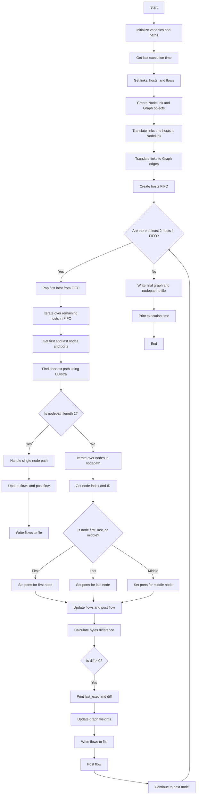

```mermaid
graph TD
    A[Start] --> B[Initialize variables and paths]
    B --> C[Get last execution time]
    C --> D[Get links, hosts, and flows]
    D --> E[Create NodeLink and Graph objects]
    E --> F[Translate links and hosts to NodeLink]
    F --> G[Translate links to Graph edges]
    G --> H[Create hosts FIFO]
    H --> I{Are there at least 2 hosts in FIFO?}
    I -- Yes --> J[Pop first host from FIFO]
    J --> K[Iterate over remaining hosts in FIFO]
    K --> L[Get first and last nodes and ports]
    L --> M[Find shortest path using Dijkstra]
    M --> N{Is nodepath length 1?}
    N -- Yes --> O[Handle single node path]
    O --> P[Update flows and post flow]
    P --> Q[Write flows to file]
    N -- No --> R[Iterate over nodes in nodepath]
    R --> S[Get node index and ID]
    S --> T{Is node first, last, or middle?}
    T -- First --> U[Set ports for first node]
    T -- Last --> V[Set ports for last node]
    T -- Middle --> W[Set ports for middle node]
    U --> X[Update flows and post flow]
    V --> X
    W --> X
    X --> Y[Calculate bytes difference]
    Y --> Z{Is diff > 0?}
    Z -- Yes --> AA[Print last_exec and diff]
    AA --> AB[Update graph weights]
    AB --> AC[Write flows to file]
    AC --> AD[Post flow]
    AD --> AE[Continue to next node]
    AE --> I
    I -- No --> AF[Write final graph and nodepath to file]
    AF --> AG[Print execution time]
    AG --> AH[End]
```
