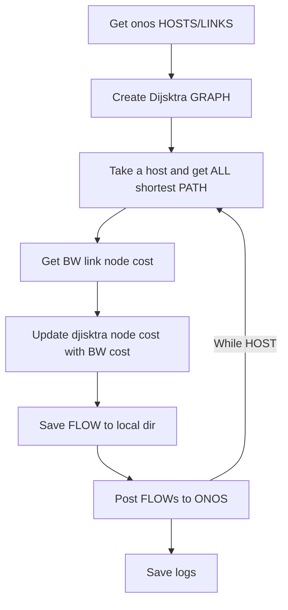

```mermaid
flowchart TD
    A[Get onos HOSTS/LINKS]
    B[Create Dijsktra GRAPH]
    C[Take a host and get ALL shortest PATH]
    D[Get BW link node cost]
    E[Update djisktra node cost with BW cost]
    F[Save FLOW to local dir]
    G[Post FLOWs to ONOS]
    H[Save logs]

    A --> B --> C --> D --> E --> F --> G --> H;
    G -->|While HOST| C;
```
